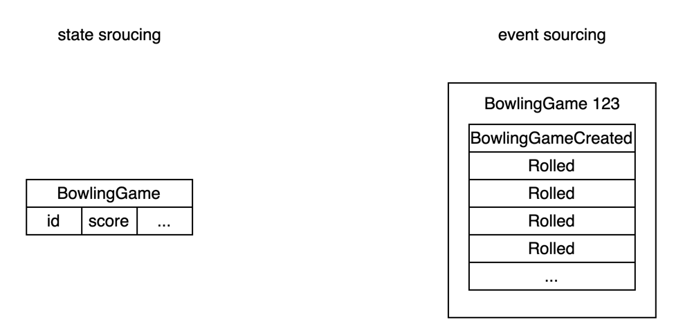
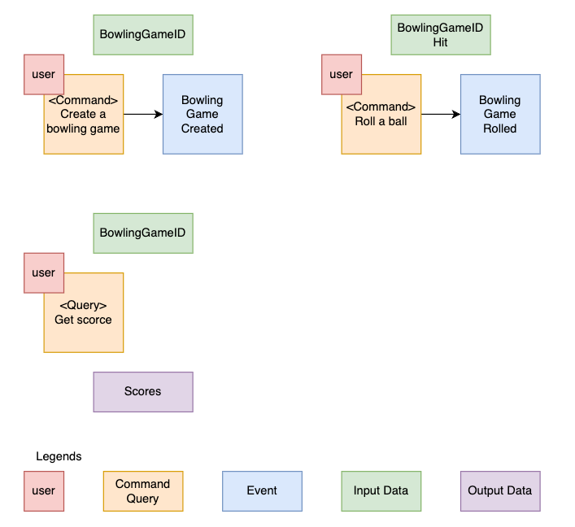

practice-event-sourcing
---

Event sourcing is a way to update state and publish event. The traditional way to persist an entity is to save its current state. A business object with event sourcing is persisted by storing a sequence of state changing events. And CQRS (Command Query Responsibility Segregation) always comes with event sourcing, but that is not include in this article.

## Why Event Sourcing?
- accurate audit logging
- release the responsibility from write operation
- easy for the analysis the data
- database would not be the bottleneck
- support multiple read model

## Why not use Event Sourcing?
- increase the complexity on read operation
- hard to build the data model

## Event sourcing in practice
In this section, we are going to practice the event souring by implementing a bowling game.

## Example code
Source code: [cs-lexliu/practice-event-sourcing](https://github.com/cs-lexliu/practice-event-sourcing)

In [bowling_game.go](https://github.com/cs-lexliu/practice-event-sourcing/blob/main/pkg/domain/bowling_game/entity/bowling_game.go), the `BowlingGame` model has been implemented as a event sourcing model.

- `Create` and `Roll` are the command methods response to generate the event.
- `When` method is the event handler contains most of the business logic of bowling game.
- `newBowlingGameFromEvent` is a constructor to create the `BowlingGame` model from events.

In [use case package](https://carousell.atlassian.net/wiki/spaces/~799623842/pages/1842938627/What+is+Event+Sourcing#:~:text=In-,usecase%20package,-%2C%20CreateBowlingGame%20and), `CreateBowlingGame` and `RollOneBall` is the use case command service, they operate the domain model and store the state into the database. Repository is the interface of the database, this is the dependency inversion to decouple the database dependency from service.

If you are interested in the usage of this example, check [main.go](https://github.com/cs-lexliu/practice-event-sourcing/blob/main/cmd/bowling-game-cli/main.go) file. This is a console program for playing the bowling game.

Last, most of the magic in under [ddd package](https://github.com/cs-lexliu/practice-event-sourcing/tree/main/internal/ddd). This package contains the reusable behavior by using theses package me can add new domain model easier.

## References:

- [Why Event Sourcing?](https://eventuate.io/whyeventsourcing.html)
- [What is Event Sourcing? - Event Store Blog](https://www.eventstore.com/blog/what-is-event-sourcing)
- [Event Sourcing Example & Explained in plain English](https://www.youtube.com/watch?v=AUj4M-st3ic)
- [CQRS, Event Sourcing Patterns and Database Architecture | Upsolver](https://www.upsolver.com/blog/cqrs-event-sourcing-build-database-architecture)
- [When not to use Event Sourcing? - Event-Driven.io](https://event-driven.io/en/when_not_to_use_event_sourcing/)
- [https://levelup.gitconnected.com/basics-of-event-sourcing-12ebe0b86788](https://levelup.gitconnected.com/basics-of-event-sourcing-12ebe0b86788)
- [Event sourcing vs CRUD - RisingStack Engineering](https://blog.risingstack.com/event-sourcing-vs-crud/)
